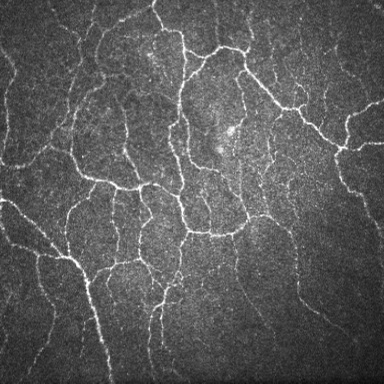
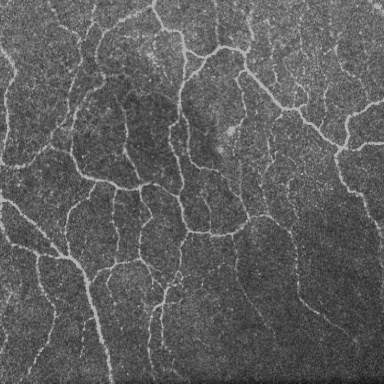
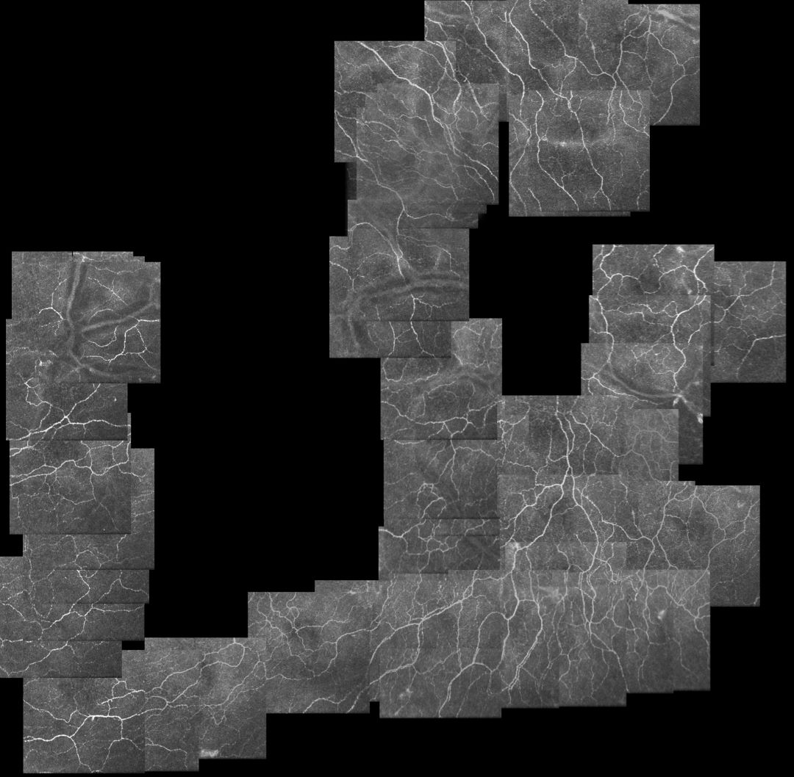

# Corneal\_Confocal\_Microscopic\_Image\_Dataset-CCMID-

[TGU-UOW Lab](http://www.tgu-uow.com/)

## Dataset Introduction
The CCMID dataset provides three different types of image data：

* **raw_data**: An unprocessed image set. The image size is 384 × 384, the image format is .Jpg.
* **processed_data**: Image set with image vignetting processing. Prevent affecting subsequent image stitching operations.
* **stitched_data**：Manually stitching images. The image format is .tif, and '- tracking' is the corneal nerve tracking extracted image of the stitched image.

**Folder Structure:**

example：

    |-- raw_data
        |-- OD
        |-- OS
    |-- processed_data
		|-- OD
        |-- OS
    |-- stitched_data

### raw_data 

### processed_data 

### stitched_data 

## Citing CCMID
If you use CCMID in a scientific publication, we would appreciate references to the following paper:

Biblatex entry:

``
Coming soon
``

## Contact Us
To discuss the dataset, Please contact email

liguangxu@tiangong.edu.com

litianyu@tiangong.edu.com

## Copyright
See LICENSE for details.  
Do not use for commercial purposes without permission.  
Copyright (c) 2021 TGU-UOW

---
# 角膜共聚焦显微图像数据集（CCMID）

## 数据集介绍
CCMID数据集提供3种不同的图像数据

* raw_data: 未经任何处理的图像，图像尺寸为384×384，图像格式为.jpg。
* processed_data: 对原图像进行了渐晕处理，防止影响后续图像拼接操作。
* stitched_data：手动拼接图像，图像格式为.tif，-tracking为拼接图像的角膜神经追踪提取图像。

## 引用 CCMID
如果您在论文中使用CCMID数据集，我们将感谢您参考以下论文：

Biblatex entry:

``
Coming soon
``

## Contact Us
讨论数据集的相关问题或其他问题，请通过电子邮件联系：

**liguangxu@tiangong.edu.com**

**litianyu@tiangong.edu.com**

## 版权所有
未经允许，禁止用于商业用途  
Copyright (c) 2021 TGU-UOW